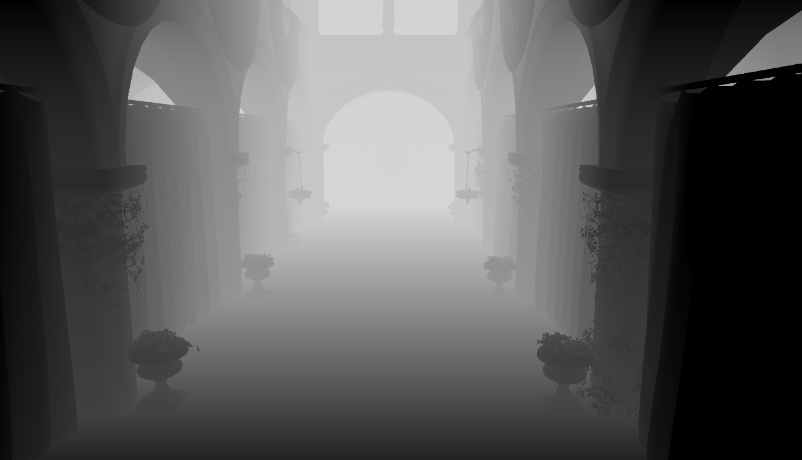
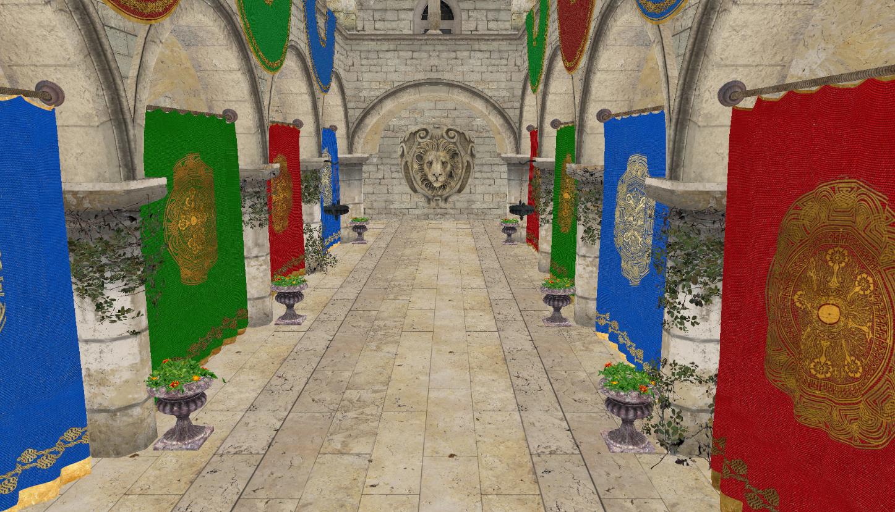
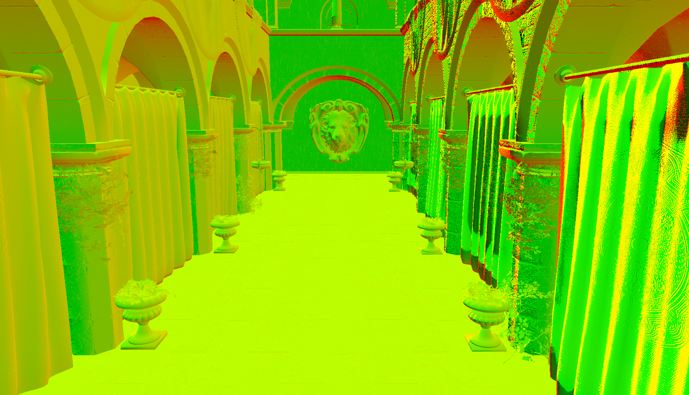
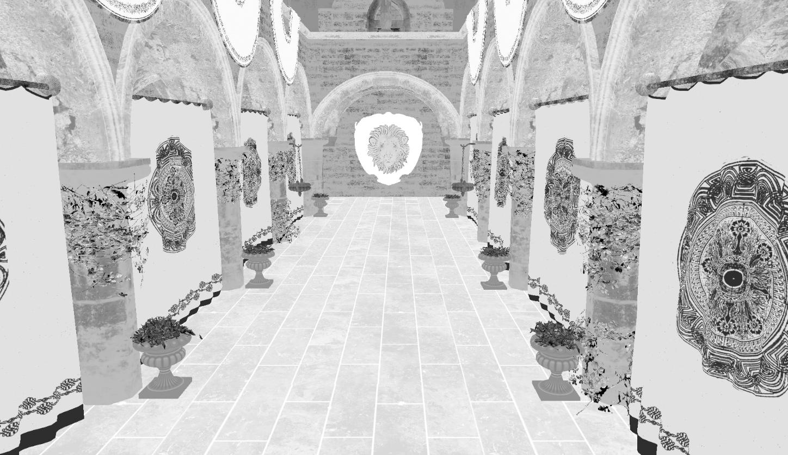
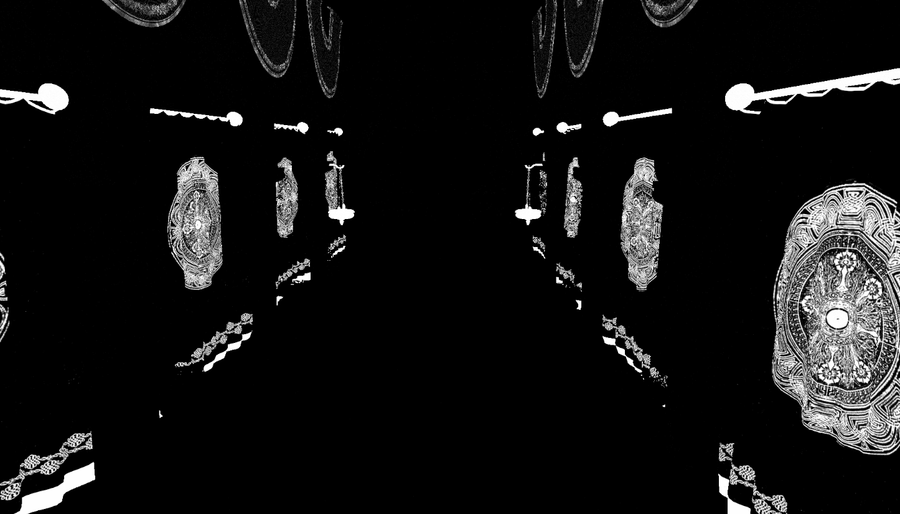
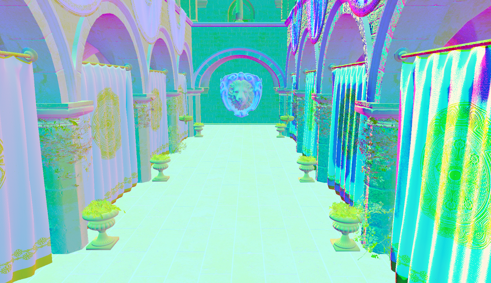
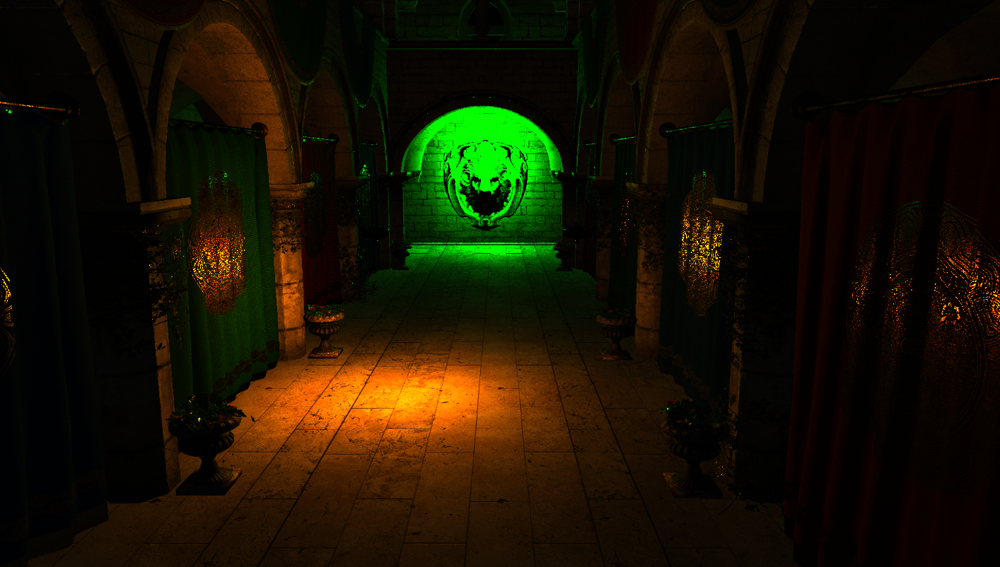
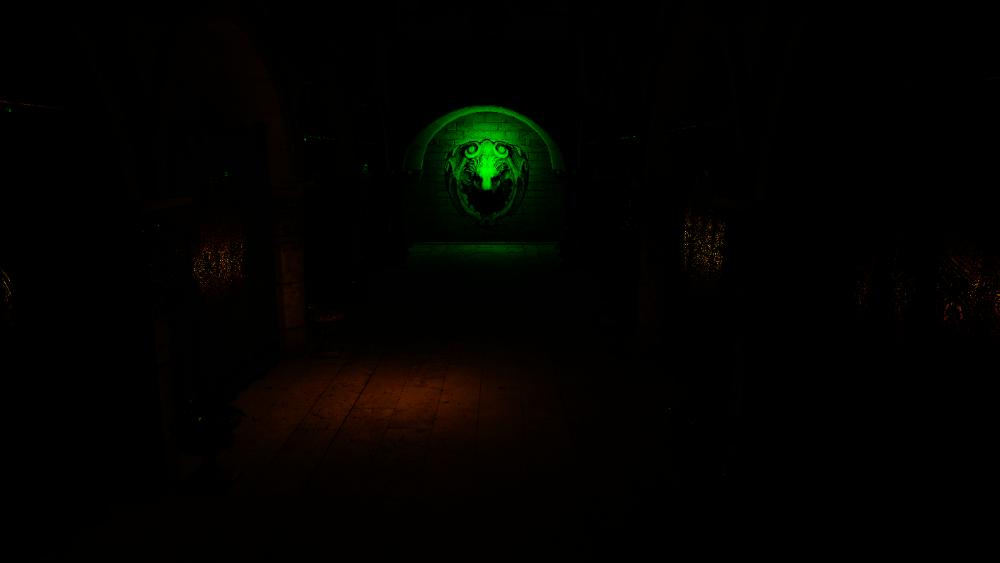
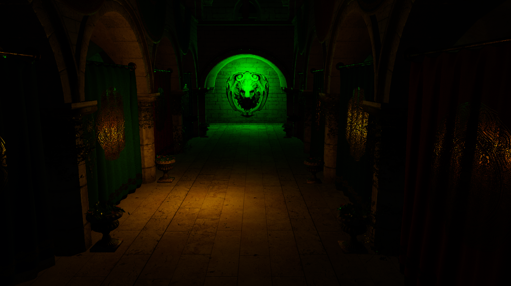

# pretty vulkan printer

> Arthur van den Barselaar

https://github.com/Howest-DAE-GD/graphics-programming-2-vulkan-project-Arthur-van-den-Barselaar

https://github.com/user-attachments/assets/a15b8aac-ff3d-45bb-8977-f636ff13b1ac

Vulkan deferred renderer. 
Created for graphics programming 2 DAE howest.

### Features
- load models with assimp
- load images using stbc_image
- Depth buffer prepass
- GBuffer render to 2 images
  - Albedo (RGBA)
  - Normal(RG), Roughness(B) Metal(A).
- Light pass. (Cook-Torrance BRDF)
  - point light
  - Directional light
- Post processing
  - Tone mapping (ACES)
  - Exposure 
- HDR to LDR

# Passes

prepass Depth buffer

Gpass albedo

G pass normals RG

G pass roughness (B)

G pass metal (A)

G pass (RGB)

Light pass

Post processing (Exposure + tone mapping)

Final result

